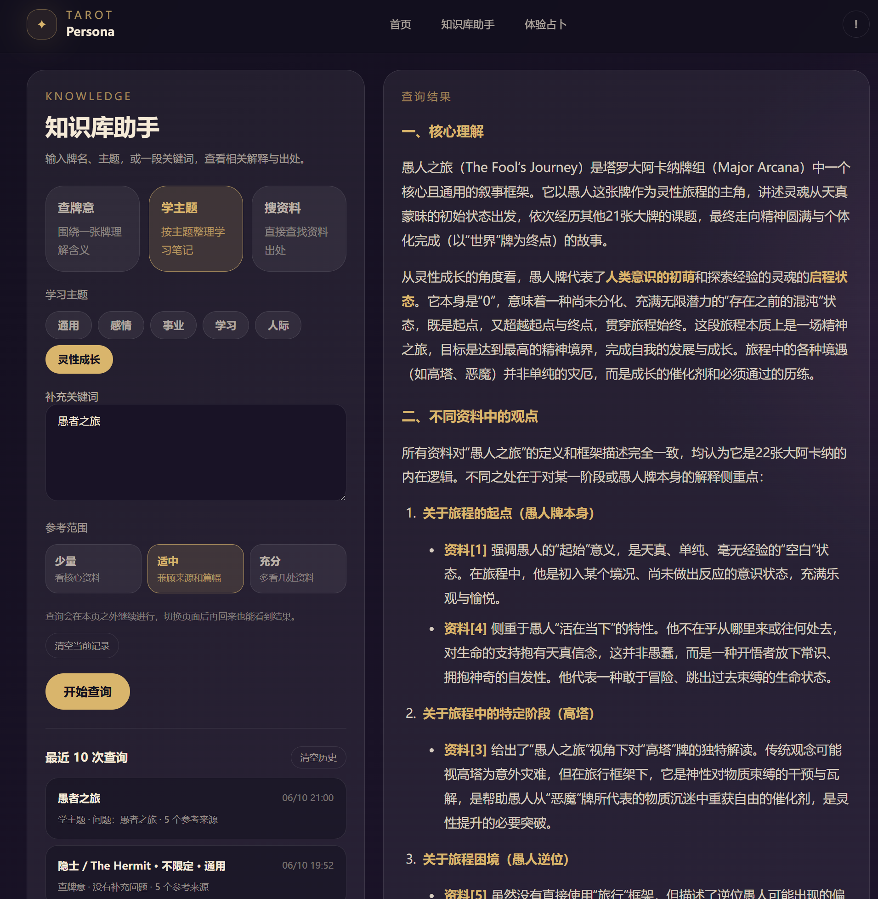
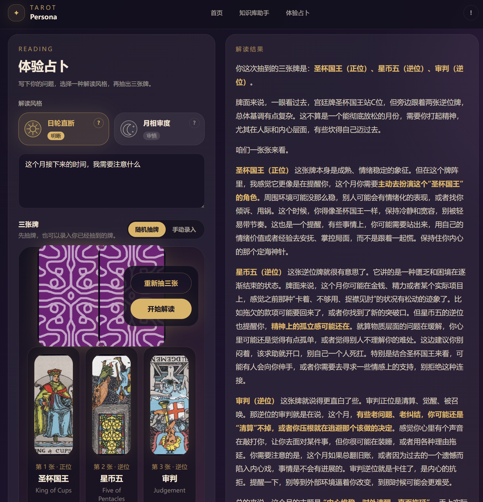

# Tarot Persona Agent

一个本地运行的塔罗知识库和多 Persona 占卜 Agent。它可以把塔罗资料整理成可检索的知识库，结合人工整理的占卜案例和占卜师画像，借助检索增强生成（RAG），实习综合资料学习和塔罗占卜。

## What this is

这个仓库用于个人塔罗学习、资料复盘和实习项目展示。PDF、占卜案例、向量索引、模型缓存和 API key 都按本地私有数据处理。

项目有两条使用路径。需要整理资料和检查数据时，打开 Streamlit 后台；需要体验用户侧占卜和知识库问答时，启动 FastAPI 后端和 Next.js 前端。

## Showcase

--Next.js 前端--
知识库助手用于查资料和学习，占卜Agent用于体验不同占卜师风格的解读。


知识库助手支持牌意查询、主题学习和资料检索。查询结果会保留来源信息，方便与原始资料核对。



占卜页支持随机抽牌或手动录入，再由 Persona Agent 结合牌面、知识库和相似案例生成解读。



## Features

- **知识库助手**：支持牌意查询、主题学习和资料检索，回答会带回来源文件、页码和原文片段
- **Persona Agent**：支持无牌阵三张牌解读、占卜师风格选择、相似案例检索和可选的风格自检
- **资料入库**：支持 PDF 文本抽取、扫描页 OCR、页内段落切块、`BAAI/bge-m3` 本地 embedding 和向量检索
- **后台管理**：支持入库状态检查、案例审核、资料审核、占卜师画像编辑和项目运行状态查看
- **本机前端**：提供首页、知识库助手、占卜Agent和本机状态页

## Tech stack

- **Backend**：Python、Streamlit、FastAPI
- **Agent and RAG**：LangGraph、LangChain-compatible documents、DeepSeek OpenAI-compatible API
- **Retrieval**：`BAAI/bge-m3` local embeddings、ChromaDB、NumPy vector-store fallback
- **Document processing**：PyMuPDF、RapidOCR ONNX Runtime
- **Frontend**：Next.js 15、React 19、TypeScript、Tailwind CSS

## Architecture

项目把后台、接口和前端分开，方便单独调试：

- `Streamlit`：内部后台，负责资料入库、案例审核、画像编辑和状态检查
- `FastAPI`：本机 API，把 Python RAG 和 Agent 能力给前端调用
- `Next.js`：用户侧前端，负责占卜Agent、知识库问答和本机状态展示
- `src/tarot_agent`：核心 Python 模块，包含配置、PDF 解析、embedding、向量检索、LangGraph Agent 和 prompt

## Run locally

先复制配置文件，并在 `.env` 里填入 DeepSeek API key：

```powershell
Copy-Item .env.example .env
```

```text
DEEPSEEK_API_KEY=your_deepseek_api_key_here
```

安装 Python 依赖。默认会把虚拟环境、模型和 pip 缓存放到 `E:\for-LLM\AUXI\Tarot_Persona_Agent`；如果你的辅助目录不同，修改 `$AuxRoot` 即可：

```powershell
$AuxRoot = "E:\for-LLM\AUXI\Tarot_Persona_Agent"
powershell -ExecutionPolicy Bypass -File scripts\setup_env.ps1 -AuxRoot $AuxRoot
```

构建知识库索引：

```powershell
& "$AuxRoot\.venv-clean\Scripts\python.exe" scripts\ingest_documents.py
```

只使用内部后台时，启动 Streamlit：

```powershell
powershell -ExecutionPolicy Bypass -File scripts\start_app.ps1
```

体验前端时，先启动 FastAPI，再启动 Next.js：

```powershell
powershell -ExecutionPolicy Bypass -File scripts\start_api.ps1
```

```powershell
powershell -ExecutionPolicy Bypass -File scripts\start_web.ps1
```

## Local apps

本地服务默认使用这些地址：

```text
http://127.0.0.1:8501        Streamlit 内部后台
http://127.0.0.1:8787        FastAPI 后端
http://127.0.0.1:8787/docs   FastAPI API 文档
http://127.0.0.1:3000        Next.js 前端
```

前端页面：

```text
/           首页
/reading    三牌占卜 Agent
/knowledge  知识库助手
/status     本机状态
```

前端默认连接 `http://127.0.0.1:8787`。需要改后端地址时，设置 `NEXT_PUBLIC_API_BASE_URL`。

## Development checks

后端测试使用 Python 标准库 `unittest`：

```powershell
$AuxRoot = "E:\for-LLM\AUXI\Tarot_Persona_Agent"
& "$AuxRoot\.venv-clean\Scripts\python.exe" -m unittest discover -s tests
```

前端类型检查：

```powershell
Set-Location web
npm.cmd run typecheck
```

## Data and privacy

`Doc/`、`Tarotist-*`、向量索引、OCR 缓存、模型缓存和案例 JSONL 文件保留在本地。

原始资料、截图案例和本地索引都属于私有工作数据。公开仓库只保留代码、配置模板、示例画像和项目文档。

## Current limitations

- 项目按本机运行设计，没有公网部署配置，但通过 Cloudflare Tunnel 实现了公网临时地址
- 前端主要面向电脑端，移动端仍需优化
- 生成模型使用 DeepSeek OpenAI-compatible 接口
- embedding 使用本地 `BAAI/bge-m3`
- ChromaDB 可以作为向量库后端使用，NumPy 向量索引用于本机备用方案
- 扫描 PDF 依赖 OCR 质量，少量页面可能仍需要人工检查
- 牌图截图案例不默认自动识别牌名，缺牌名的案例需要人工标注后再入库
- GPU 版 PyTorch 当前按 `torch==2.6.0+cu124` 配置

## Project layout

主要目录和入口：

```text
app.py                  Streamlit 内部后台入口
api/                    FastAPI 本机接口
web/                    Next.js 前端
src/tarot_agent/        RAG、Agent、配置和数据处理核心模块
scripts/                环境、启动、入库和案例处理脚本
data/personas/          示例占卜师画像
docs/assets/            README 展示截图
tests/                  RAG 和知识过滤测试
Doc/                    本地 PDF 资料，不提交到 Git
Tarotist-*/             本地截图案例，不提交到 Git
```
